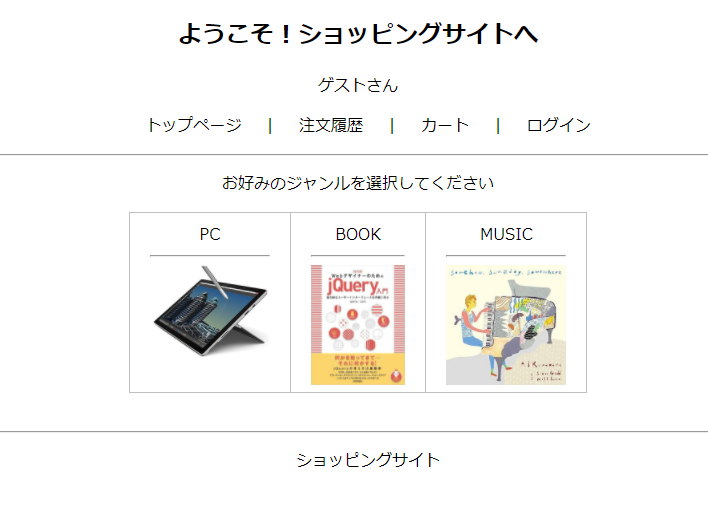
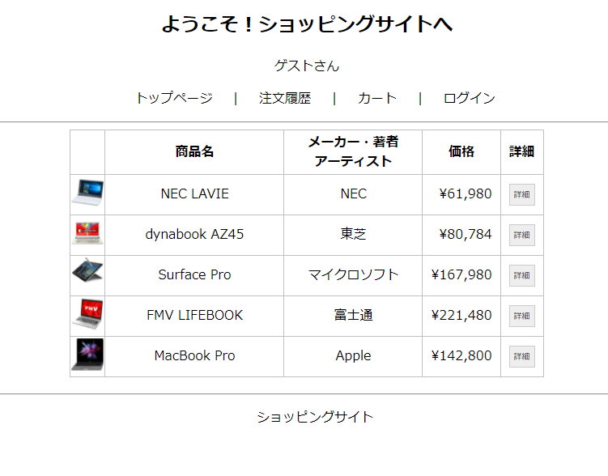
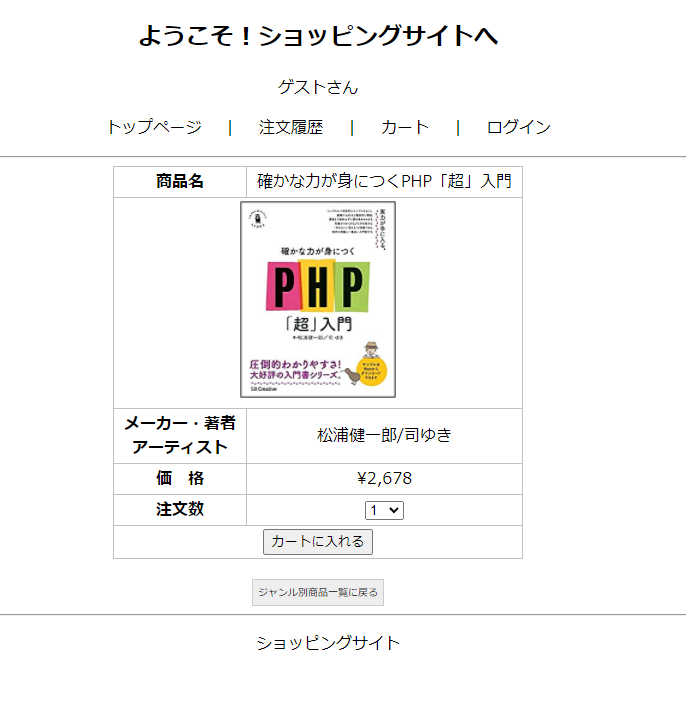
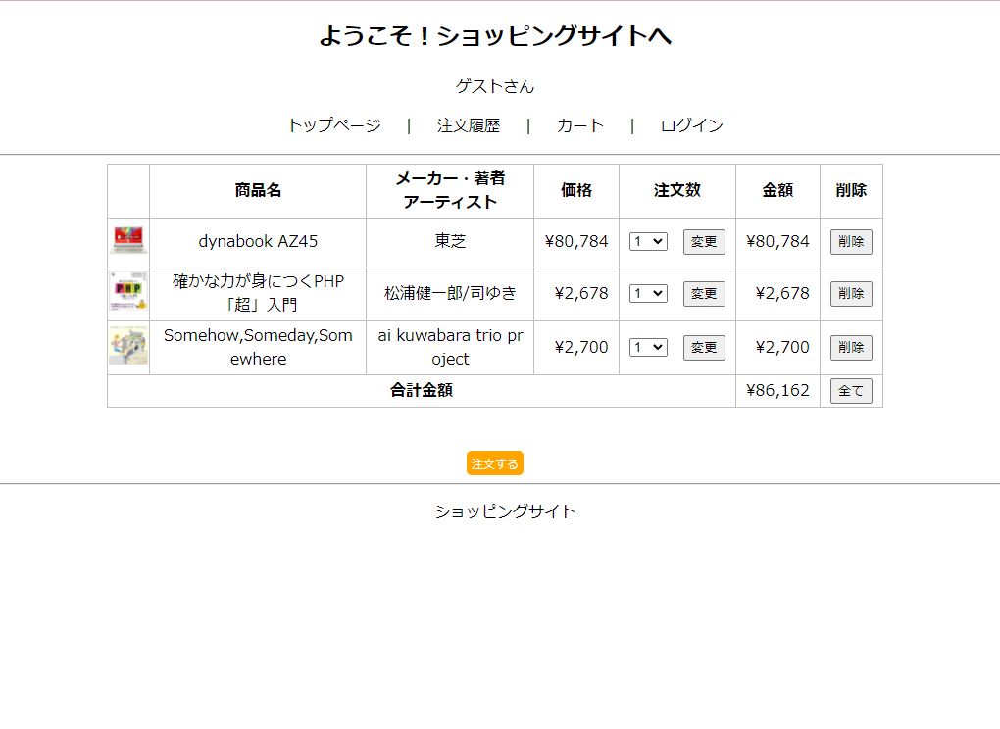

# Likuathub
このリポジトリは作成したWebサイトを公開し、提出するためのもの。

## 内容
- インターネットショッピングサイトを模して作成した、データベースおよびHTML,php,cssを学ぶための成果物。
- Webサイトを実行するための手引きを記載している手順書。

## デモ
- phpで作成したショッピングウェブサイト。データーベースを使用して、ログインやカートへの追加、削除、注文確定が可能。

    
    
    
    

## 文責
- 作成者 越智陸仁

